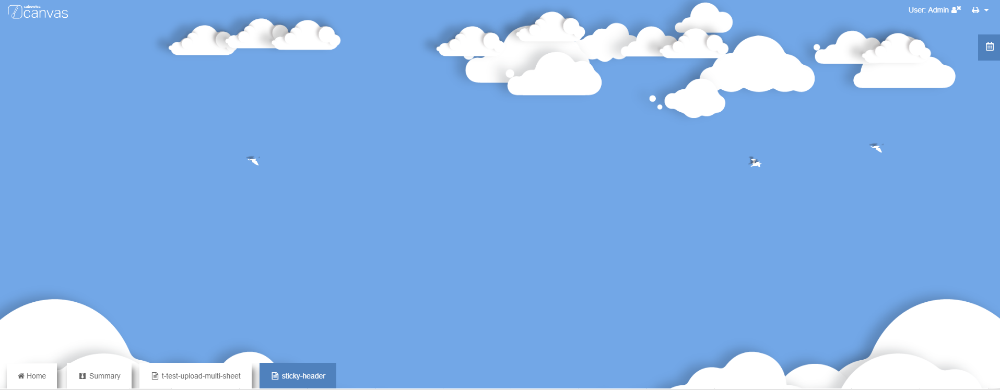

# Navigation
Canvas Application Template

Step 1: Stop Cubewise Application Server from Services.
Step 2: Copy a "canvas_base" folder from the "CWAS" folder of the Canvas install directory
Step 3: Paste the folder into "webapps" folder inside the "CWAS" folder
Step 4: Rename the new folder with a new app name (e.g "NEWAPP")
Step 5: From the git download the Application folder to desktop
Step 6: Replace all the files in "NEWAPP" folder with downloaded content from Github
Step 7: Start the Cubewise Application Server.
Step 8: Test your new Application http://localhost:8080/NEWAPP

